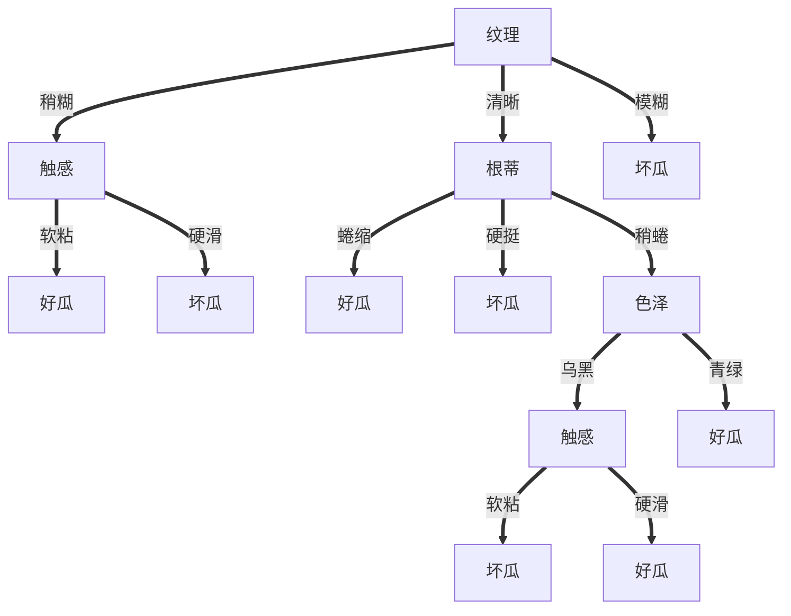

# Decision Tree

## Python version

```mermaid
graph TB
_t0[纹理]
_t1[触感]
_t4[根蒂]
_t12[坏瓜]
_t2[好瓜]
_t3[坏瓜]
_t5[好瓜]
_t6[坏瓜]
_t7[色泽]
_t8[触感]
_t11[好瓜]
_t9[坏瓜]
_t10[好瓜]
_t0==稍糊==>_t1
_t0==清晰==>_t4
_t0==模糊==>_t12
_t1==软粘==>_t2
_t1==硬滑==>_t3
_t4==蜷缩==>_t5
_t4==硬挺==>_t6
_t4==稍蜷==>_t7
_t7==乌黑==>_t8
_t7==青绿==>_t11
_t8==软粘==>_t9
_t8==硬滑==>_t10
```