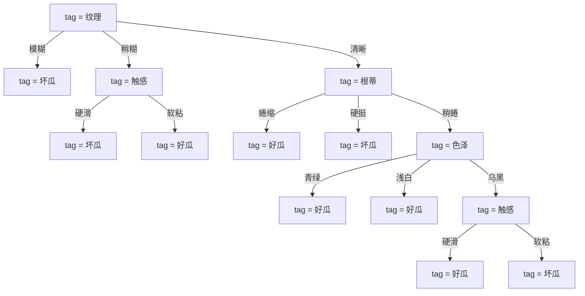

```mermaid
graph TB
_t0[tag = 纹理]
_t1[tag = 坏瓜]
_t2[tag = 触感]
_t5[tag = 根蒂]
_t3[tag = 坏瓜]
_t4[tag = 好瓜]
_t6[tag = 好瓜]
_t7[tag = 坏瓜]
_t8[tag = 色泽]
_t9[tag = 好瓜]
_t10[tag = 好瓜]
_t11[tag = 触感]
_t12[tag = 好瓜]
_t13[tag = 坏瓜]
_t0--模糊-->_t1
_t0--稍糊-->_t2
_t0--清晰-->_t5
_t2--硬滑-->_t3
_t2--软粘-->_t4
_t5--蜷缩-->_t6
_t5--硬挺-->_t7
_t5--稍蜷-->_t8
_t8--青绿-->_t9
_t8--浅白-->_t10
_t8--乌黑-->_t11
_t11--硬滑-->_t12
_t11--软粘-->_t13
```

